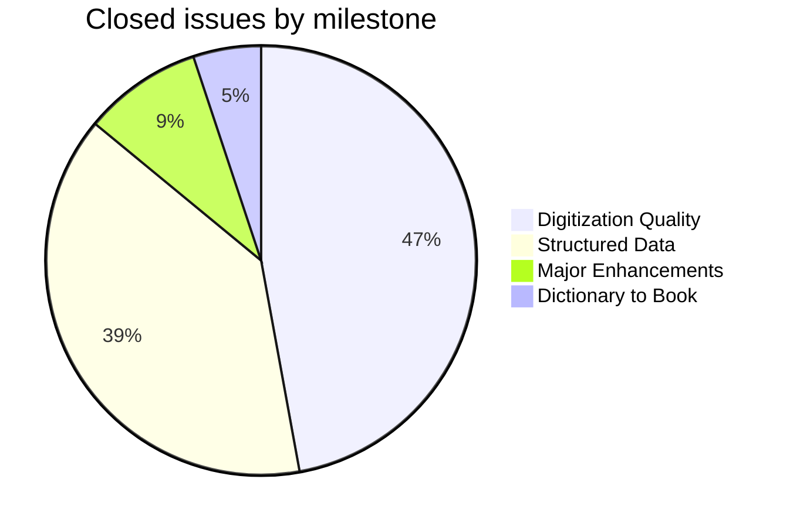
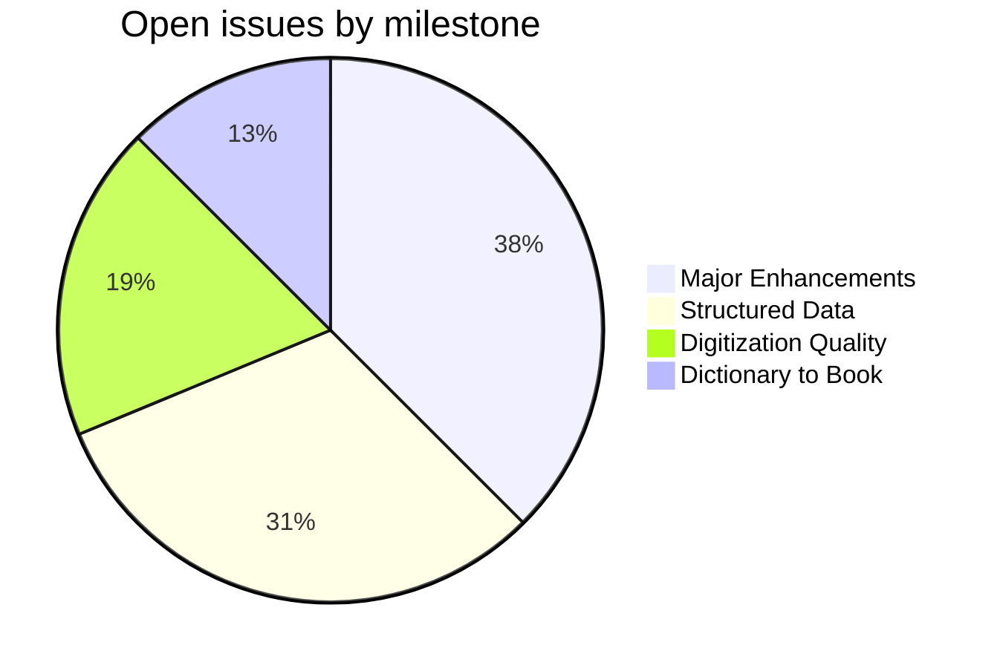
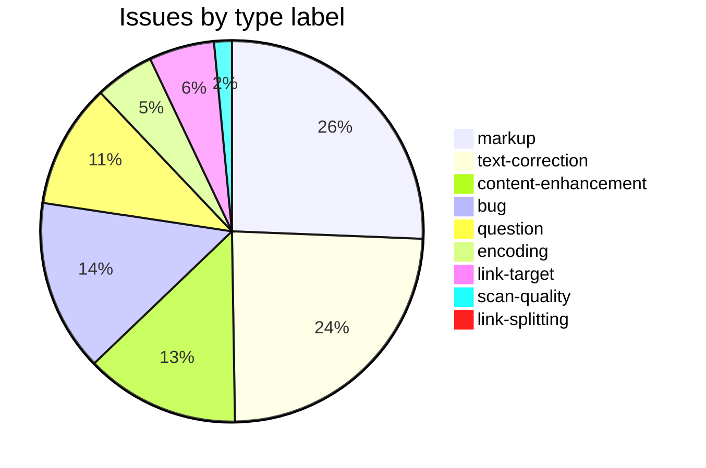

MWS
===

Monier Monier-Williams, Sir; *A Sanskrit-English Dictionary*. Oxford, 1899.

This repository holds corrections, enhancements, and tooling for the [Cologne digitization](http://www.sanskrit-lexicon.uni-koeln.de/) of the MW dictionary. The canonical source data (`mw.txt` in SLP1 encoding) lives in [csl-orig](https://github.com/sanskrit-lexicon/csl-orig); the build system is in [csl-pywork](https://github.com/sanskrit-lexicon/csl-pywork). Issues and corrections are tracked at the [MWS GitHub issue tracker](https://github.com/sanskrit-lexicon/MWS/issues).

## Contents

| Directory | Description |
|-----------|-------------|
| `history/` | Original MONIER.ALL from Thomas Malten (2004); cp1252→UTF-8 conversion |
| `homophone/` | Homophone markup corrections and enhancements; Java and Python pipelines |
| `mwtranscode/` | Transcoding between SLP1, IAST, and Devanagari |
| `mwsissues/` | Per-issue correction workflows and documentation |
| `mwabbreviations/` | Analysis of abbreviations used in the digitization |
| `mwauthorities/` | Works and authors cited in MW |
| `mwverbs/` | Verb and preverb extraction from the digitization |
| `botbio/` | Botanical (`<bot>`) and biographical (`<bio>`) tag extraction |
| `k1k2/` | Headword key1/key2 clash analysis |
| `accent_diff/` | Accent markup discrepancy analysis |
| `Lithuanian/` | Lithuanian word list comparison against MW |
| `mwsupplement/` | MW supplement entries |
| `greek_andhrabharati/` | Greek words comparison between Cologne digitization and Andhrabharati |
| `CORRECTIONS_issue_362/` | Language-tag corrections from Nagabhushana Rao (@Andhrabharati) (csl-corrections issue #362) |
| `verbs01/` | Verb merge and cross-reference tooling |
| `transcodeExample/` | Example transcoder PHP/Python scripts and SLP1→IAST table |
| `basic04a/` | Simple two-dictionary web display sample |
| `list02php/` | PHP-based display sample |

## Timeline

| Date | Milestone |
|------|-----------|
| 2004 | Thomas Malten provides MONIER.ALL — original digitization in cp1252 encoding |
| Jan 2014 | Repository initialized; early data analysis (hiatus entries, avagraha, space in keys) |
| Sep 2014 | Transcoder example added (issue #5) |
| Apr–Jun 2015 | Homophone corrections: ~6,500 removeHom + 10,913 artificial homophones assigned |
| Dec 2015 | k1k2 headword clash analysis |
| Jul 2016 | mwauthorities XML structure established |
| Feb 2017 | Web display samples added (basic04a, list02php) |
| Nov 2017 | mwabbreviations analysis added |
| Jan 2020 | Greek words file received from Nagabhushana Rao (@Andhrabharati) (issue #89) |
| Jun 2020 | botbio tag extraction and mwverbs pipeline added |
| Jan 2021 | mwtranscode: SLP1 ↔ IAST ↔ Devanagari pipeline; Lithuanian comparison; Andhrabharati (AB) version work |
| 2024 | Issues 141–181: accent corrections, Grassmanizing, AB3 (Andhrabharati) alternate format, supplement revisions |
| Aug–Nov 2025 | Issue 190: recovery of 16+ lost headwords (with Nagabhushana Rao (@Andhrabharati) and Scott Rhodes (@aumsanskrit)) |
| Feb 2026 | History folder: MONIER.ALL archived and documented |

## Projects & Milestones

Work is organised into four GitHub Projects (org-level kanban boards), each mirroring a milestone:

| Project | Milestone | Open | Closed | Scope |
|---|---|---|---|---|
| [**Dictionary to Book**](https://github.com/orgs/sanskrit-lexicon/projects/5) | [milestone](https://github.com/sanskrit-lexicon/MWS/milestone/5) | 4 | 8 | Link targets and link splitting |
| [**Digitization Quality**](https://github.com/orgs/sanskrit-lexicon/projects/6) | [milestone](https://github.com/sanskrit-lexicon/MWS/milestone/6) | 6 | 74 | Scan quality, encoding, bug fixes, text corrections |
| [**Structured Data**](https://github.com/orgs/sanskrit-lexicon/projects/7) | [milestone](https://github.com/sanskrit-lexicon/MWS/milestone/7) | 10 | 61 | Markup normalisation, structured data improvements, editorial questions |
| [**Major Enhancements**](https://github.com/orgs/sanskrit-lexicon/projects/8) | [milestone](https://github.com/sanskrit-lexicon/MWS/milestone/8) | 12 | 14 | Display upgrades, new data, large structural additions |

## Issue Typology

Issues track two broad concerns: **enriching the XML** (markup, link targets) and **improving the digitization** (encoding, scan quality, text corrections).

#### Solved (closed issues)

| Type | Description | Examples |
|---|---|---|
| **Link targets** | Building clickable references from `<ls>` abbreviations to scanned PDF pages (7 issues). | Hyperlinking MW to Panini [#77](https://github.com/sanskrit-lexicon/MWS/issues/77), Gram. link [#159](https://github.com/sanskrit-lexicon/MWS/issues/159), VIKRAMORVAŚĪ [#188](https://github.com/sanskrit-lexicon/MWS/issues/188), Ramayana [#151](https://github.com/sanskrit-lexicon/MWS/issues/151) |
| **Link splitting** | Splitting combined `N,N` refs into per-page links (1 issue). | Dhātup. links [#126](https://github.com/sanskrit-lexicon/MWS/issues/126) |
| **Markup** | Normalising XML tag content and structure: `<ls>`, `<ab>`, `<lex>`, `<bot>`, `<hom>`, `<bio>` (44 issues). | Missing ls tags [#112](https://github.com/sanskrit-lexicon/MWS/issues/112), RV `<ls>` cleanup [#134](https://github.com/sanskrit-lexicon/MWS/issues/134), `<hom>` consistency [#131](https://github.com/sanskrit-lexicon/MWS/issues/131), 6800 missing ¦ [#132](https://github.com/sanskrit-lexicon/MWS/issues/132) |
| **Text corrections** | Corrections to headwords, definitions, accent marks, and orthography (46 issues). | Accent correction phase 1–4 [#141](https://github.com/sanskrit-lexicon/MWS/issues/141), [#142](https://github.com/sanskrit-lexicon/MWS/issues/142), [#145](https://github.com/sanskrit-lexicon/MWS/issues/145), typos [#102](https://github.com/sanskrit-lexicon/MWS/issues/102) |
| **Content enhancement** | Display upgrades, new data, structural additions (14 issues). | Cross-entry links [#64](https://github.com/sanskrit-lexicon/MWS/issues/64), supplement [#83](https://github.com/sanskrit-lexicon/MWS/issues/83), verbs01 [#75](https://github.com/sanskrit-lexicon/MWS/issues/75) |
| **Encoding** | SLP1/IAST/Devanagari transcoding, Greek and Lithuanian rendering (8 issues). | Lithuanian IAST [#79](https://github.com/sanskrit-lexicon/MWS/issues/79), Greek text [#153](https://github.com/sanskrit-lexicon/MWS/issues/153), German encoding [#42](https://github.com/sanskrit-lexicon/MWS/issues/42) |
| **Scan quality** | Replacing missing or poor-quality scan pages (3 issues). | Two missing pages [#81](https://github.com/sanskrit-lexicon/MWS/issues/81), scan review [#144](https://github.com/sanskrit-lexicon/MWS/issues/144) |
| **Bug fixes** | Broken display, XML errors, broken links (27 issues). | Abnormal `<root/>` tag [#27](https://github.com/sanskrit-lexicon/MWS/issues/27), punctuation in ls refs [#54](https://github.com/sanskrit-lexicon/MWS/issues/54), nikāya lost [#128](https://github.com/sanskrit-lexicon/MWS/issues/128) |
| **Questions resolved** | Scholarly and editorial questions researched and answered (18 issues). | MW missing feminine data [#84](https://github.com/sanskrit-lexicon/MWS/issues/84), ŚivaPurāṇa refs [#125](https://github.com/sanskrit-lexicon/MWS/issues/125), Zend language [#114](https://github.com/sanskrit-lexicon/MWS/issues/114) |

#### Open (work ahead)

| Type | Description | Examples |
|---|---|---|
| **Link targets** | Sources still needing index and links installed (4 open issues). | PAÑCATANTRA [#185](https://github.com/sanskrit-lexicon/MWS/issues/185), ŚĀKUNTALA [#186](https://github.com/sanskrit-lexicon/MWS/issues/186), MĀLAVIKĀGNIMITRA [#187](https://github.com/sanskrit-lexicon/MWS/issues/187), missing links [#129](https://github.com/sanskrit-lexicon/MWS/issues/129) |
| **Markup** | XML tag normalisation still in progress (7 open issues). | New markup for alternates [#147](https://github.com/sanskrit-lexicon/MWS/issues/147), tag inventory [#168](https://github.com/sanskrit-lexicon/MWS/issues/168), titular abbreviations [#172](https://github.com/sanskrit-lexicon/MWS/issues/172) |
| **Text corrections** | Dictionary text errors still to be fixed (2 open issues). | Feminine headword [#183](https://github.com/sanskrit-lexicon/MWS/issues/183), two headwords [#192](https://github.com/sanskrit-lexicon/MWS/issues/192) |
| **Content enhancement** | Display upgrades and new data (12 open issues). | Display variant part 2 [#73](https://github.com/sanskrit-lexicon/MWS/issues/73), resolving idems [#98](https://github.com/sanskrit-lexicon/MWS/issues/98), grouped entries [#163](https://github.com/sanskrit-lexicon/MWS/issues/163), web font [#170](https://github.com/sanskrit-lexicon/MWS/issues/170) |
| **Encoding** | Transcoding edge cases (2 open issues). | IAST to ISO 15919 [#155](https://github.com/sanskrit-lexicon/MWS/issues/155), recoding shortlong [#164](https://github.com/sanskrit-lexicon/MWS/issues/164) |
| **Bug fixes** | Known display and link errors (2 open issues). | &c. abbreviation [#86](https://github.com/sanskrit-lexicon/MWS/issues/86), MW links to Mn. [#189](https://github.com/sanskrit-lexicon/MWS/issues/189) |
| **Questions / interpretation** | Open scholarly questions (3 open issues). | cf. accord. to some [#45](https://github.com/sanskrit-lexicon/MWS/issues/45), Ka or KA [#93](https://github.com/sanskrit-lexicon/MWS/issues/93), genders in bold [#108](https://github.com/sanskrit-lexicon/MWS/issues/108) |

## Labels

Every issue carries one **type** label and one **severity** label.

#### Type

| Label | Meaning |
|---|---|
| `link-target` | Building a click-through from a `<ls>` abbreviation to scanned PDF pages |
| `link-splitting` | Splitting combined `SOURCE N,N` refs into individual per-page links |
| `markup` | Normalising XML tag content or structure (`<ls>`, `<ab>`, `<lex>`, `<bot>`, etc.) |
| `text-correction` | Corrections to headwords, definitions, accent marks, or orthography |
| `content-enhancement` | New material, display upgrades, or structural additions beyond correction |
| `encoding` | SLP1/IAST/Devanagari transcoding, Greek/Lithuanian rendering, character normalisation |
| `scan-quality` | Replacing blurry, skewed, or missing scan pages |
| `bug` | Broken display, XML structure errors, broken links |
| `question` | Scholarly or editorial questions requiring research before any code change |

#### Severity

| Label | Meaning |
|---|---|
| `minor` | Targeted, self-contained fix — a handful of entries or a single file |
| `medium` | Standard unit of work — one link-target index, a batch of corrections |
| `hard` | Large effort spanning many entries, files, or dictionaries |

## Contributors

- **Thomas Malten** — provided the original MONIER.ALL digitization (2004)
- **Peter Scharf** — designed the rational extension of homophone markup (2013); requested Python reimplementation
- **Pawan Goyal** — co-designed homophone markup with Scharf (2013)
- **Jim Funderburk** ([@funderburkjim](https://github.com/funderburkjim)) — primary repository maintainer; tooling and correction workflows
- **Mārcis Gasūns** ([@gasyoun](https://github.com/gasyoun)) — initial commit and early data analysis
- **drdhaval2785** ([@drdhaval2785](https://github.com/drdhaval2785)) — k1k2 clash analysis; AB/Cologne comparison tooling
- **Nagabhushana Rao** (@Andhrabharati) — Greek words file; AB version analysis; extensive issue contributions
- **Scott Rhodes** (@aumsanskrit) — issue analysis and corrections (issue #190 and others)
- **Darius** — Lithuanian word list comparison

## Homophone corrections and enhancements

See the [readme.txt](https://github.com/sanskrit-lexicon/MWS/blob/master/homophone/readme.txt) in the homophone directory.
