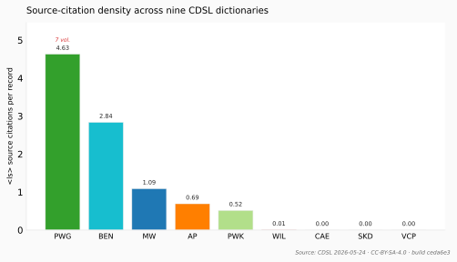
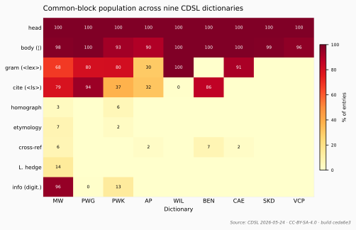

# The microstructure of *Monier-Williams 1899*: a data-grounded framework, triangulated against three metalexicographic traditions

**Draft for the [*International Journal of Lexicography*](https://academic.oup.com/ijl) (Oxford University Press).** Single consolidated submission (~7.4K words, within IJL's ~8–10K window). Supersedes the four parallel framework drafts; the three external-framework treatments are condensed into [Appendices A–C](#appendix-a--the-wiegand-theoretic-reading-condensed). Data source: [MICROANALYSIS.md](MICROANALYSIS.md). All numerical claims are reproducible from the published [`mw.txt`](https://github.com/sanskrit-lexicon/csl-orig/blob/master/v02/mw/mw.txt) via the scripts in [`analysis/`](analysis/); the empirical audits cited in [§9](#9-methodological-limitations) have been completed since the first draft.

**Theoretical framing:** primarily *data-grounded* (the analytic apparatus is built from MW outward); the three dominant metalexicographic traditions — [Wiegand](#appendix-a--the-wiegand-theoretic-reading-condensed) (1989, 2002), [Atkins & Rundell](#appendix-b--the-atkins-rundell-practical-lexicography-reading-condensed) (2008), and [Hausmann](#appendix-c--the-hausmann-wiegand-comment-class-reading-condensed) (1977, 1985) — are applied in the appendices and used in §7 as convergent triangulation, not as the primary lens.

---

## Abstract

This paper builds a descriptive framework for *Monier-Williams 1899* (henceforth MW) **from the artefact outward**, treating its 18 formal blocks, 8 primary article types, and 3 orthogonal article-properties as primary — before consulting Wiegand (1989, 2002), Hausmann (1977, 1985), or Atkins & Rundell (2008), the three frameworks built on European mid-to-late-20th-century dictionaries that otherwise risk imposing categories the lexicographer himself did not recognise. The framework that emerges has five constructs — **block, slot, profile, hedge, infrastructure** — each operationalised against the live [`mw.txt`](https://github.com/sanskrit-lexicon/csl-orig/blob/master/v02/mw/mw.txt) digital edition (286,561 records). Its central empirical claim is that MW is a **block-economical** dictionary: a six-block kernel is reused across all entries, with type-driven enrichment. We then **triangulate** this grounded reading against the three external traditions (§7, full treatments in Appendices A–C) and find that all three converge on the same three structural facts under different terminologies — kernel-plus-enrichment economy, the singular `<ls>L.</ls>` hedge, and the distinctive continuation entry — evidence that the findings are properties of the artefact, not of one theory. A cross-dictionary audit of nine CDSL dictionaries ([§8](#8-implications-for-future-cdsl-work)) shows that *block-economy* is a typological signature of single-volume scholarly dictionaries generally, while the `<ls>L.</ls>` hedge is MW's structural systematisation of a typographic convention pioneered by Cappeller (1891) and Benfey (1866) — an organising principle distinguishing 19th-century scholarly dictionaries from both modern learner-dictionaries (more pragmatic information, fewer formal blocks) and indigenous Sanskrit koshas (different infrastructure entirely).

**Keywords:** microstructure, grounded analysis, Monier-Williams, Sanskrit lexicography, CDSL, block economy, scholarly dictionary, Wiegand, Atkins–Rundell, Hausmann

---

## 1. Introduction: one artefact, one grounded framework, three witnesses

Scholarly metalexicography is dominated by frameworks built between 1977 and 2008 on dictionaries from a narrow band of European traditions (French, German, English). They have produced powerful taxonomies — Wiegandian microstructure, Hausmann comment-classes, Atkins-Rundell production/retrieval typology. But each framework also **imposes categories**. Wiegand's "fully integrated microstructure" presupposes a sense-hierarchy that MW's `<e>1A` continuation-by-adjacency pattern does not quite realise. Hausmann's four comment-classes lacked a category for MW's lexicographer-hedge (we add one in [Appendix C](#appendix-c--the-hausmann-wiegand-comment-class-reading-condensed)). Atkins-Rundell's typology of dictionary purposes assumes a 21st-century user.

We therefore make the **grounded reading primary**: we build the analytical apparatus from MW itself, consulting external frameworks only afterward, for comparison. This yields a *minimal* framework — five constructs — that captures MW's design with no superfluous categories, and lets us see what is **specific to MW** that the imported frameworks dilute or miss.

The three external frameworks are not discarded. They are **witnesses**. A finding that surfaces independently under Wiegand's microstructure theory, under Atkins & Rundell's practical-lexicography handbook, and under the Hausmann-Wiegand comment-class hybrid is a finding about MW, not about any one theory. This **triangulation** (§7) is the consolidated paper's methodological backbone, and it is why the present study is one paper and not four: presenting the same data through four parallel framings as four separate articles would be salami-slicing; presenting one grounded analysis *corroborated* by three independent framings is convergent validation. The full framework-specific treatments are preserved as [Appendices A–C](#appendix-a--the-wiegand-theoretic-reading-condensed); the body of the paper is the grounded reading plus the triangulation.

## 2. Data and method

Our data is the [working-notes file](MICROANALYSIS.md), built by parsing every `<L>...<LEND>` record in the live [`mw.txt`](https://github.com/sanskrit-lexicon/csl-orig/blob/master/v02/mw/mw.txt) (48.9 MB, 286,561 records, fetched 2026-05-23 from [`csl-orig`](https://github.com/sanskrit-lexicon/csl-orig)) and counting formal-block occurrences. The block-detection source is in the [docs-pass build artefacts](https://github.com/sanskrit-lexicon/MWS/tree/docs-pass). Counts are reproducible from the published `mw.txt`. Block detection is **regex-based and approximate**; its known false-positive and false-negative cases are documented in [§9](#9-methodological-limitations) and should be read alongside every percentage in this paper.

## 3. The five grounded constructs

### Construct 1 — *Block*

A **block** is a discriminable structural component of an MW entry. We identify 18 such blocks (see [MICROANALYSIS.md §1](MICROANALYSIS.md)). The block is the **atomic unit** of analysis. We make no a priori claim about what blocks *should* be present, and no a priori taxonomy of block-roles. A block has a **marker** (a tag, glyph, or stereotyped position that lets us detect it), a **population** (the number of entries containing it), and an **occurrence profile** (the rate at which it co-occurs with each other block — the matrix in [MICROANALYSIS.md §4](MICROANALYSIS.md)).

### Construct 2 — *Slot*

A **slot** is an ordered position within an entry where blocks may occur. MW's slot order (from `<L>` to `<LEND>`) is fixed:

```
[F01 header] → [F02 display headword] [F03 hom] [F04 lex] [F05 cl./P./Ā.]
            → [F06 √] [F07 lang] [F08 inflection forms] [F09 commentary]
            → ¦ → [F10 gloss] [F11 sense divisions] → [F12 ls cites] [F13 L. hedge]
            → [F14 bot] [F15 bio] [F16 cross-ref] → [F17 info] → [F18 corrections]
            → <LEND>

```

Many slots are **optional**. The *grammatical category* slot exists; whether F04 fills it depends on the article type. The slot architecture is what distinguishes MW from a free-form dictionary (entries are not arbitrary prose) and from a purely tabular dictionary (entries are not key-value pairs). The slot view is also the **renderer's view** — MW's [SQLite generation pipeline](https://github.com/sanskrit-lexicon/csl-pywork/blob/master/v02/makotemplates/pywork/sqlite/sqlite.py) walks the slots in order and emits HTML.

### Construct 3 — *Profile*

A **profile** is the *block-set characteristic of an article type*. We identify **8 primary article types** (root, nominal, adjective, indeclinable, compound, derived, continuation, encyclopedic) crossed with **3 orthogonal properties** (Vedic-accented, lex-hedged, IE-cognate-bearing) — a refactor of the original 14-bucket classification that separates *what kind of entry this is* from *what additional information it happens to carry* (see [MICROANALYSIS.md §3](MICROANALYSIS.md), and the rationale in [DOUBTS D5](DOUBTS.md#d5--article-type-typology--14-is-too-many--overlapping--important)). Each type has a characteristic profile composed of a **necessary-block set** (blocks present in ≥ 95% of entries of this type), an **enriched-block set** (blocks present at substantially higher rates than baseline — e.g. F09 commentary at 78% in roots vs ~10% baseline), and an **omitted-block set** (blocks present at substantially lower rates than baseline — e.g. F02 display headword at 33.9% in continuations vs ~99% baseline). The orthogonal properties cut across types: a *Vedic-accented nominal* is a nominal with an extra `/` mark in `<k2>` and an inflation of the etymology block; a *lex-hedged compound* is a compound that happens to carry `<ls>L.</ls>`. The profile is the **lexicographer's strategic choice** for handling a type of lemma; each of MW's 8 primary profiles is internally coherent — see the [block-by-type matrix](MICROANALYSIS.md#4--the-block-by-article-type-matrix).

### Construct 4 — *Hedge*

A **hedge** is a block whose function is to modify the evidentiary status of the entire entry. MW has one explicit hedge: `<ls>L.</ls>` (F13). Its function is to signal that the entry's sole evidence is the indigenous lexicographer tradition. Hedges are distinct from blocks-in-general because they (i) operate at the **entry level**, not the slot level — an `L.`-hedge does not qualify the gloss it follows, it qualifies the whole entry's evidentiary basis; (ii) have a **transverse distribution** — they appear across many article types rather than concentrating in one (F13 at 71.5% of botanicals, 64.7% of biographicals, 100% of lex-hedged-as-primary-feature entries); and (iii) carry **reader-guidance** — they tell the user how to weight the entry's content. MW has exactly one hedge; PWG had zero (a different design choice — see [Lineage section](../../DICT_PROFILE.md#lineage-wil--koshas-mw--pwg)). The hedge is the **single most distinctive block** in MW's design — although the *concept* of an inline lexicographer-only marker predates MW (typographically) in Cappeller 1891 (asterisk) and Benfey 1866 (dagger); MW's contribution is to promote it into the tagged source-citation slot ([Appendix C §C.2](#appendix-c--the-hausmann-wiegand-comment-class-reading-condensed)).

### Construct 5 — *Infrastructure*

**Infrastructure** is the set of blocks that exist to support the dictionary's *processability* — not its *content*. MW has two infrastructure blocks: F17 `<info>` machine annotation (in 96% of entries) and F18 correction record (< 30 instances). Infrastructure is not a Hausmann or Wiegand category. It is a **digital-era construct** — a block that has no analogue in the print dictionary. The print MW1899 has no `<info>` tag; the CDSL editors added it during digitisation to support the SQLite pipeline and the web display. Treating F17 as infrastructure (not as part of microstructure proper) preserves the original-vs-digital distinction.

## 4. The block-economy thesis

Our central empirical observation is this: **MW reuses a small core of blocks across an enormous number of entries**. The modal entry has **6 blocks**, drawn from a kernel of 5–7 (F01, F02, F04, F10, F12, F17, and either F08 or F13). The remaining 11–12 blocks are *type-specific enrichments* that appear in a small fraction of entries.

We name this **block economy**. Quantitatively:

| Block | Population (% of entries) | Role |
|---|--:|---|
| **F01 Record header** | 100% | Kernel |
| **F17 Machine annotation** | 96% | Kernel (digital-era) |
| **F02 Display headword** | 76%\* | Kernel |
| **F10 Sense gloss** | ~100% | Kernel |
| **F12 Source citation** | ~80% | Kernel (high) |
| **F04 Grammatical category** | 65% | Kernel (medium) |
| F08 Inflection form | 21% | Type-enriched |
| F13 Hedge L. | 13% | Type-enriched |
| F09 Editorial commentary | 6% | Type-enriched |
| F06 Etymology root | 6% | Type-enriched |
| F03 Homophone marker | 5% | Type-enriched |
| F14 Botanical | 3% | Type-specific |
| F11 Sense division | < 1% | Type-specific (rare) |
| F07 IE cognate | 0.7% | Type-specific (rare) |
| F15 Biographical / `<s1>` name | 13%† | Type-specific |
| F05 Verb inflection class | < 1% | Type-specific (verbs only) |
| F16 Cross-reference | 9% | Distributed |
| F18 Correction record | < 0.01% | Vanishing |

\* The structural headword key `<k1>` is present in 100% of records; **76%** carry a *rendered* `<s>`/`<s1>` display form (continuations and many compounds inherit or suppress it). † F15 counts `<bio>` **or** `<s1>` (encyclopedic name encoding); biographical-*proper* entries are < 0.2%. These figures, and the F08/F09 rates, are from the reproducible [block-detector audit](analysis/SPOTCHECK.md).

**Six blocks (F01, F02, F04, F10, F12, F17) recur in 65–100% of entries.** These six **make MW MW** in its *digital* form. Of the six, **F17 `<info>` is a digital-era addition** (added during CDSL digitisation; not present in the print MW1899). Strictly speaking, the **print-MW1899 kernel is therefore 5 blocks** (F01, F02, F04, F10, F12), and the **digital-MW kernel is 6 blocks** (the five print blocks plus F17). The headlines "6-block kernel" and "MW reuses a small core of blocks across an enormous number of entries" should be read as claims about the *digital* edition — the artefact this paper analyses. The print MW1899's kernel is one block smaller. We retain "6-block kernel" as the headline throughout because the paper analyses the digital edition; readers comparing to the printed *Sanskrit-English Dictionary* (Oxford 1899) should subtract F17. The other twelve blocks are deployed sparingly, in type-specific clusters, in both print and digital editions.

This is **block economy** — a term we use in two related but distinct senses, and which we will mark accordingly throughout this paper:

- ***Block-economy the morphology*** — the empirical **shape** of the block-presence distribution: a small modal kernel (5–6 blocks in MW's digital edition) plus a long tail (rare elaborate types reaching 10+ blocks). This is a property of the artefact one can observe by counting.
- ***Block-economy the constraint*** — the **print-economic pressure** that produces the morphology: a 19th-century single-volume printed dictionary cannot afford to elaborate every block in every entry. Print space is finite; setting cost is real; the user must be able to scan. This is a hypothesised cause of the morphology, not the morphology itself.

The morphology is what we measure; the constraint is what we *infer* from comparing morphologies across dictionaries with different production circumstances. MW's design *responds to* the constraint by maintaining a kernel and adding to it only when the article-type demands. MW's source dictionary PWG is far denser: it carries [more `<ls>` citations in total](../../DICT_PROFILE.md#lineage-wil--koshas-mw--pwg) (570,817 vs MW's 311,932) across **less than half** the entries, so **per entry PWG is ~4× more citation-dense** (4.6 vs 1.1 `<ls>` per record; [cross-dict audit](analysis/CROSS_DICT.md)). PWG can afford this because it is a multi-volume work; MW1899 is one volume, and its lower density is the print-economic constraint *made visible* — i.e. the morphology is shaped by the constraint. Importantly, the cross-dict audit ([§9.3](#9-methodological-limitations)) shows the *morphology* is **common to all single-volume CDSL dictionaries, not unique to MW**; the *constraint* is therefore not MW-specific either. We present block economy (the morphology) as a typological **signature characteristic of single-volume scholarly dictionaries** that MW instantiates, with the constraint hypothesised as the proximate cause. Neither claim is original to this paper; what is original is the quantification.

### 4.1 Sense division is record-granular, not block-internal

The block-economy table records F11 (sense division) at **< 1%** of entries — the rarest content block in the inventory. Taken in isolation this invites the wrong inference: that MW seldom distinguishes the senses of a polysemous lemma. The opposite holds. MW distinguishes senses prolifically; it simply does so at the granularity of the **record** rather than inside the entry body.

Two measurements establish this, both reproducible in a single pass over the 2026 `mw.txt` (the source file of the [block-detector audit](analysis/SPOTCHECK.md)). First, the gloss-zone is singular per record: of 286,560 records, **282,199 (98.5%) carry exactly one `¦` sense-delimiter**, three carry two, and **none** carry an in-prose enumerated apparatus (`(a) … (b)`, `1) … 2)`). The entry body is not a container for a numbered sense-list. Second, the senses of a base headword are realised by **promotion to a sibling record**: **20,152 records carry a top-level continuation code** (`<e>1A`/`1B`/`1C`), spreading a polysemous lemma's senses across consecutive records that share its `<k1>`. The lemma *agni* spreads eight senses across records L890–L897 (all `<e>1A`: "the number three", "the god of fire", "bile", "gold", "N. of various plants", …); *dharma* spreads its senses across L99904–L99911 ("usage", "right, justice", "virtue", "Law personified", "the law or doctrine of Buddhism", …). What a print dictionary sets as a numbered run inside one article, MW's digitisation realises as a run of records under one key. (A further 72,518 records carry *derived* `<e>2*` or *compound* `<e>3*` codes; these are MW's promotion of derivatives and compounds to headword status — a **macrostructural** strategy, distinct from the sense-polysemy at issue here — and are not counted as senses of the base lemma.)

This is a further instance of block economy, not a counter-example to it. The entry stays minimal — one gloss-zone, the six-block kernel — and the burden of polysemy is carried by the *vertical* axis of the slot architecture, the `<e>` continuation code, rather than by elaborating an in-entry sense-division block. The near-absence of F11 is thus a **design choice made visible**: the sense-structural counterpart of the citation economy quantified above.

The verb is the systematic exception. Verbal entries *do* subdivide within the record, using the self-closing `<div n="to"/>` marker for successive senses (11,000 instances) and `<div n="vp"/>` for verbal-derivative blocks — causative, desiderative, intensive (3,792 instances). MW therefore operates **two** sense-division mechanisms — record-granular for nominal, compound, and derived entries; block-internal for verbs — and neither is the inline numbered sense-list that a `<div>`-counting detector expects.

That asymmetry has a methodological consequence for cross-dictionary comparison. A microstructure measure that operationalises "sense depth" by counting inline sense-`<div>` markers would score MW at or near zero — not because MW lacks sense structure, but because MW encodes that structure in the record boundary and the `<e>` code. For MW, sense depth must be read off the record grouping; a `<div>`-only measure is **detector-blind** to MW's dominant mechanism (cf. the cross-dict audit, [§9.3](#9-methodological-limitations), and the tooling implications in [§8](#8-implications-for-future-cdsl-work)). The caution generalises: an apparent structural absence in a tagged dictionary may reflect a tagging convention rather than a content gap.

## 5. Profiles as the unit of typology

Once block-economy is recognised, the article-type *profile* (Construct 3) becomes the natural unit of lexicographic typology. The earlier 14-bucket classification (preserved in [MICROANALYSIS.md §3.1 legacy table](MICROANALYSIS.md#31--the-original-14-bucket-classification-legacy)) conflated two orthogonal axes — *what kind of entry this is* versus *what additional information it happens to carry* (DOUBTS D5). The refactored typology resolves this into **8 primary types** plus **3 orthogonal properties**, and each of MW's 8 primary profiles is a **specific deviation** from the 6-block kernel.

### 5.1 The primary types (8 + 1)

| # | Type | Defined by | Count | % of 286,561 |
|--:|---|---|--:|--:|
| 1 | **root** | `<info verb="genuineroot"/>` | 750 | 0.26% |
| 2 | **nominal** (sub-feature: gender m/f/n/mn) | `<lex>m./f./n./mn.</lex>` w/o compound marker | ≈ 37,700 | ≈ 13.2% |
| 3 | **adjective** | `<lex>mfn.</lex>` | 12,240 | 4.27% |
| 4 | **indeclinable** | `<lex>ind.</lex>` | 1,929 | 0.67% |
| 5 | **compound sub-entry** | `<e>3*` + em-dash/hyphen in `<k2>` | 126,360 | 44.10% |
| 6 | **derived form** | `<e>2*` | 72,119 | 25.17% |
| 7 | **continuation sub-entry** | `<e>1A` | 9,294 | 3.24% |
| 8 | **encyclopedic** (sub-feature: botanical / biographical) | `<bot>` or `<bio>` tag(s) | 8,405 | 2.93% |
| 9 | **verbal lemma** (added 2026-05-27, per [DOUBTS D18 audit](DOUBTS.md#d18--audit-of-the-other-residual--resolved-2026-05-27-as-verbal-lemma-promotion)) | `√` symbol or `<ab>P.</ab>`/`<ab>Ā.</ab>`/`<ab>cl.</ab>` in body, ecode ≠ continuation | 7,502 | 2.77% |
| — | *other* (true residual after promotion) | none of the above; deeply-nested / polysemy-tail / non-canonical-lex | ≈ 11,000 | ≈ 4.0% |

### 5.2 The 3 orthogonal properties

| Property | Defined by | Count | % of 286,561 | Most concentrated in |
|---|---|--:|--:|---|
| **Vedic-accented** | `/` in `<k2>` | 47,598 | 16.6% | nominals, especially Vedic vocabulary |
| **Lex-hedged** | `<ls>L.</ls>` present | 40,212 distinct entries | ≈ 14.0% | 100% of former "lexicographer_only"; 72% of botanicals, 65% of biographicals (cross-cuts every primary type) |
| **IE-cognate-bearing** | `<lang>` tag(s) | 2,099 | 0.73% | roots (F07 = 35%); a separate enriched sub-population |

These three are **properties, not types**: an entry can be (e.g.) a *Vedic-accented, lex-hedged nominal*, a *non-accented compound*, or an *IE-cognate-bearing root*. The cross-tabulation appears in [MICROANALYSIS.md §3.3](MICROANALYSIS.md#33--cross-tabulation-of-primary-types--orthogonal-properties).

### 5.3 Three illustrative profiles

**The verbal-root profile.** Kernel present: F01, F02, F10, F12, F17 (skipping F04 — verbs are not in `<lex>`). Enrichments: F05 verb class (98.4%), F08 inflection forms (99.9%), F03 homophone (49.6%), F09 commentary (78.1%), F06 root marker (44.7%), F07 IE cognate (35.2%), F16 cross-reference (54.5%). Result: average 9.73 of 18 blocks — **the most elaborate profile in MW**. Roots are 0.26% of entries; they receive the largest share of editorial apparatus.

**The compound-sub-entry profile.** Kernel present: F01, F02 (84.7%), F04 (80.7%), F10 (97.9%), F17 (96.3%). Enrichments: F12 source citation (81.2%), F08 inflection (18.5%) — modest additions. Suppressions: F03 (0.9%), F05 (0.3%), F06 (1.6%), F07 (0.1%), F09 (3.5%), F11 (0.0%), F14 (3.3%), F15 (14.7%), F16 (4.7%). Result: average 6.02 blocks — **the kernel + a citation, almost nothing more**. Compounds are 44% of MW's entries; their economical treatment is what makes the dictionary printable.

**The lex-hedged profile (orthogonal).** Across primary types, the *lex-hedged* property contributes: F12 = 100% (the hedge is itself an `<ls>`), F13 = 100% (definitional). Where lex-hedging is the entry's *only* distinguishing feature (≈ 38,414 entries — the old "lexicographer_only" type), kernel present: F01, F02, F04 (65.2%), F10 (100%), F17 (99.2%); average 6.89 blocks. Where lex-hedging *additionally decorates* an encyclopedic entry, F13 reaches 72% in botanicals and 65% in biographicals — the property piggy-backs on the type. The hedge is the entry's distinctive content in the former case and an evidentiary modifier in the latter.

### 5.4 The 8×3 profile table

The entire grounded analysis collapses into one printable diagnostic — the **MW primary-type profile table**:

| Primary type | Kernel (F01-02-04-10-12-17) | Distinctive enrichments | Distinctive suppressions | Avg blocks | % lex-hedged | % Vedic-acc. |
|---|---|---|---|--:|--:|--:|
| Root | F02+F10+F12+F17 (no F04) | F05 cl.,P.,Ā. (98%); F08 forms (100%); F09 (78%); F06 √ (45%); F07 IE (35%); F16 (55%); F03 hom (50%) | F04 (gram absent) | 9.73 | 7% | 8% |
| Nominal (m / f / n) | full kernel | F12 (66–78%); F08 (18–23%); F14 elevated in f. (6%) | — | 6.05–6.43 | 12–21% | 18–24% |
| Adjective | full kernel | F06 (17%) | F14, F15 lowest | 6.25 | 4% | 11% |
| Indeclinable | full kernel | F08 (30%); F09 (12%) | F14 (0.1%) | 6.39 | 2% | 9% |
| Compound | F01,F02,F04 (81%),F10,F17 | F12 (81%); F08 (18%) | F03, F05, F06, F07, F09, F11, F14, F15 all suppressed | 6.02 | 13% | 14% |
| Derived | F01,F02 (69%),F04 (51%),F10,F17 | F12 (81%); F08 (23%) | most enrichments suppressed | 5.73 | 16% | 19% |
| Continuation | F01,F10,F17 only (F02, F04 inherited) | F12 (81%) | F02 (34%); F04 (0.3%); F08 (7%) | 4.76 | 21% | 12% |
| Encyclopedic — botanical | F01, F02 (67%), F04 (69%), F10, F12, F14 (100%) | F13 hedge (72%); F08 (14%) | F02 lower (display by `<bot>`) | 7.28 | **72%** | 6% |
| Encyclopedic — biographical | F01, F02, F04 (75%), F10, F12 (94%), F15 (100%) | F13 hedge (65%); F08 (20%) | — | 7.58 | **65%** | 16% |

The **3 orthogonal properties** appear as columns/conditions rather than rows:

- **Lex-hedged** (≈ 14.0% overall): subsumes the former "lexicographer_only" bucket (when the property is the entry's *only* distinguishing feature; avg 6.89 blocks) and cuts across encyclopedic types (a property-modifier on a type-determined skeleton).
- **Vedic-accented** (16.6% overall): an inflector of nominals (18–24%) and roots (8%); avg 5.93 blocks when isolated — slightly under the dictionary mean, because Vedic vocabulary in MW skews toward terse glosses.
- **IE-cognate-bearing** (0.73% overall): heavily concentrated in roots (35%) and the residual *other* bucket (F07 at 24.7%; this is partly nominal stems with attached comparanda); when isolated, average 7.70 blocks — the property correlates with elaborated etymology, not with a different article skeleton.

This table is the **single most useful diagnostic** for the working CDSL editor: pick a primary type, see which blocks are expected, see what's distinctive, then ask whether the entry also carries any of the three orthogonal properties (Vedic accent, lex-hedge, IE cognate) and adjust the budget accordingly. It is also the framework's single deliverable for downstream metalexicographic comparison — the same table can be produced for any CDSL dictionary, allowing direct comparison across the corpus.

## 6. The infrastructure layer and its meaning

Construct 5 — infrastructure — does work no purely Wiegandian or Hausmannian analysis can do. F17 (`<info>` machine annotation) is present in 96% of entries. It carries machine-readable encoding of information that the human-readable blocks already convey. **It is a redundancy**, but a deliberate one: the CDSL editors needed a tag set the SQLite pipeline could parse without ambiguity, and they added it to `mw.txt` during digitisation. From a 19th-century print perspective, F17 does not exist; from a 21st-century digital perspective, it is the most pervasive block.

This dual existence — present in the digital edition, absent from the print — is the **infrastructure layer**. Recognising it explicitly lets us **preserve the historical artefact** (when we talk about MW1899-as-print, F17 is not part of it), **acknowledge the digital tooling** (when we talk about MW1899-as-data, F17 is essential), and **track digitisation choices as such** (what the CDSL editors added vs what was in the print). The infrastructure construct is **specific to digital editions of historical dictionaries**, and we propose it as a general analytical category.

## 7. Triangulation: three external frameworks converge

We now corroborate the grounded reading against the three dominant metalexicographic traditions. The full treatments are in [Appendix A (Wiegand)](#appendix-a--the-wiegand-theoretic-reading-condensed), [Appendix B (Atkins-Rundell)](#appendix-b--the-atkins-rundell-practical-lexicography-reading-condensed), and [Appendix C (Hausmann-Wiegand)](#appendix-c--the-hausmann-wiegand-comment-class-reading-condensed). Here we report only what the triangulation establishes.

### 7.1 The construct map

Each grounded construct has a near-equivalent in each external tradition — which is itself evidence that the grounded constructs carve MW at real joints:

| Grounded construct | Wiegand equivalent | Hausmann-Wiegand equivalent | Atkins-Rundell equivalent |
|---|---|---|---|
| **Block** | Item (*Angabe*) | Comment sub-element | Field |
| **Slot** | Position in microstructure | Comment sequence | Entry skeleton |
| **Profile** | Article-type (*Artikeltyp*) | Comment-class signature | Entry pattern |
| **Hedge** | (transverse structural indicator) | Provenance-comment (proposed) | Register marker |
| **Infrastructure** | — (no equivalent) | — (no equivalent) | — (no equivalent) |

### 7.2 Three findings all three frameworks reach

**(i) Kernel-plus-enrichment, not full microstructure.** The grounded reading names this *block-economy the morphology* (§4): a 6-block digital-edition kernel (F01, F02, F04, F10, F12, F17 — or a 5-block print kernel without F17) reused across 286,561 entries with modal density 6 (31.9% of entries) and a long-tail of enrichment (10+ blocks in 1.4%). Wiegand's apparatus arrives at the same place via *microstructure density* — the same modal-6 typical article positions MW above learner dictionaries (median density 4–5 under A&R's own field-typology, 2008: 199; not under our 18-block scheme) and, qualitatively, below the *Deutsches Wörterbuch* — though we do *not* report a numerical Grimm comparison (Appendix A §A.4 explains why). Atkins & Rundell arrive via the *headword-inventory + retrieval-dictionary* analysis — a maximally explicit (286,561) but economically-treated lemma list with no examples, no register labels, locator-only citations (Appendix B §B.1). Hausmann arrives via the *form-comment economy* of compounds, which inherit form-information from their members — empirically, MW's 126,360 compound sub-entries average 6.02 blocks against a 9.73-block root profile, with `F02 + F04 + F10 + F17` filling the form/sense/infrastructure slots and `F12` adding only a citation (Appendix C §C.3). Four routes, one structural fact about the morphology; the *constraint* (single-volume print economics, §4) is the inferred cause that all four readings tacitly assume.

**(ii) The `<ls>L.</ls>` hedge has a three-stage lineage; MW is first with the *concept* (1872) and first with the *tagged implementation* (1899), Cappeller is first with the *systematic typographic implementation* (1891).** The grounded reading names it the *hedge construct* (Construct 4). Wiegand identifies it as a transverse *commenting structural indicator* and a deliberate *Strukturveränderung* of PWG's source-attribution system (Appendix A §A.3). Atkins & Rundell classify it as a *pragmatic register marker* of the koshic-only register (Appendix B §B.5). Hausmann's framework has *no slot for it* and must be extended with a proposed fifth comment-class, the *Provenienz-Komment* (Appendix C §C.2). All four frameworks agree the convention is specific to MW in the CDSL corpus (40,212 instances vs 0 in PWG, PWK, WIL, BEN, CAE, SKD, VCP and 1 in AP), absent from PWG's named-kosha apparatus, and a deliberate editorial compression of PWG's named-kosha citation system. The historical lineage, verified by a 2026 preface-and-body read of MW 1872 ([analysis/LS_HEDGE_CHECK.md](analysis/LS_HEDGE_CHECK.md#mw-1872-preface-and-body-check-added-2026-05-27-d21-resolution)), Cappeller 1891 and Benfey 1866, runs in three stages: MW 1872 **declares the L.-convention** in Section II of his own preface ("when a word had not yet been met with in any published literary work, but only in native lexicons, it was decided to denote this by the letter L.") but the MW 1872 body does **not** systematically implement it (≈ 0 tagged instances, ~17 inline "L." occurrences mostly Linnaean botanical attributions). Cappeller 1891 — possibly independently, possibly following the MW 1872 preface — provides the **first systematic typographic implementation** (asterisk `*` for "word taught only by grammarians or lexicographers", 1,370 instances). MW 1899, with Cappeller as co-editor, then **scales and tags** the convention, producing 40,212 `<ls>L.</ls>` instances occupying the same source slot as `<ls>MBh.</ls>` or `<ls>RV.</ls>`. The *structural* MW-1899 innovation — promoting the hedge from a typographic mark into a tagged source-citation — therefore sits on top of MW's own 1872 conceptual declaration and Cappeller's 1891 systematic typographic precedent, not displacing either. Benfey 1866 dagger `†` ("verbs or meanings for which there are no authoritative references") is a weaker methodological precedent (the marker is for *unverified*, not specifically *kosha-only*). See [DICT_PROFILE Lineage](../../DICT_PROFILE.md#lineage-wil--koshas-mw--pwg).

**(iii) Continuation entries (`<e>1A`) are structurally distinctive.** All four readings note that MW's 9,294 continuation entries suppress display-headword (present in only 33.9%) and grammatical category (inherited from parent). The grounded reading calls them *kernel-reduced profiles* (avg 4.76 blocks, the lowest of any type); Wiegand calls them *adjacency-integration*, between full and semi-integration; Atkins & Rundell call them *adjacency-sub-entries*, a third option beyond lumping/splitting; Hausmann calls them *semantic-only* signatures (all form-comment inherited).

### 7.3 What each framework contributes that the others do not

- **Wiegand only:** MW exhibits a coherent integrated microstructure that *fits Wiegand's framework better than its 1899 date suggests* — evidence that European scholarly lexicography has a long continuous tradition Wiegand's framework captures. Wiegand also supplies a precise theory of **mediostructure** (cross-references between articles) that the grounded view treats only informally as F16; for MW's 4,401 `<ab>id.</ab>` instances a Wiegandian mediostructure analysis is more productive.
- **Atkins-Rundell only:** MW is a **retrieval dictionary** (not a production dictionary) in A&R's macro-typology — and its apparent gaps (no examples, no register labels, locator-only citations) are *coherent* under that brief rather than defects. A&R's richer typology of dictionary *purpose* is the one thing the grounded framework cannot supply on its own: it can describe MW but cannot place it in a landscape without borrowing A&R's apparatus.
- **Hausmann only:** the **Provenienz-Komment** as a proposed fifth comment-class — the framework's one novel theoretical contribution, motivated precisely by MW's hedge.
- **Grounded only:** the **infrastructure construct** (§6) — recognising that F17 `<info>` and F18 correction records are *trace of digitisation*, not part of MW1899-as-print. No external framework recognises this distinction; and **block economy** (§4) is likewise unnamed elsewhere.

### 7.4 The methodological payoff

That three independently-motivated frameworks converge on the same three structural facts is the strongest argument that those facts are real. It is also the reason this is **one paper**: the external readings are not four competing publications but three corroborating witnesses to one grounded analysis. Where they diverge (§7.3), each adds exactly one thing the others miss, and those four additions are complementary rather than contradictory.

## 8. Implications for future CDSL work

Three concrete implications:

- **For dictionary editing:** the [ROADMAP](../../ROADMAP.md) lists 34 open issues plus strategic categories (authority records, Vedic accent expansion, `L.` verification). The block-profile view suggests the highest-leverage editorial work is **filling profile-specific gaps** — e.g. systematically reducing F13 hedge incidence in botanical entries (currently 72%) via better named-source citation, recovering the kosha sources at [ARMH](https://github.com/sanskrit-lexicon/armh), [ABCH](https://github.com/sanskrit-lexicon/abch), [ACPH](https://github.com/sanskrit-lexicon/acph), [ACSJ](https://github.com/sanskrit-lexicon/acsj) (see [Appendix B §B.6](#appendix-b--the-atkins-rundell-practical-lexicography-reading-condensed)).
- **For cross-dictionary work:** each CDSL dict ([PWG](https://github.com/sanskrit-lexicon/PWG), [AP](https://github.com/sanskrit-lexicon/ap), [WIL](https://github.com/sanskrit-lexicon/WIL), [SKD](https://github.com/sanskrit-lexicon/SKD), [GRA](https://github.com/sanskrit-lexicon/GRA), [BHS](https://github.com/sanskrit-lexicon/BHS)) and the four koshas should be analysed with the same 18-block framework. A comparative table of profile-distributions would surface intellectual lineages and design contrasts no single-dictionary study can. A **first cut already exists** ([cross-dict audit](analysis/CROSS_DICT.md)): on a format-robust tag vocabulary, eight CDSL dictionaries were compared, establishing that the block-economy *shape* is general and that PWG is ~4× denser per entry ([§9.3](#9-methodological-limitations)). A per-type profile comparison now covers **all nine dictionaries** ([profiles audit](analysis/CROSS_DICT_PROFILES.md)). Among the seven structured bilingual dicts, the **single-volume** works differentiate their `<lex>` gender-types by citation rate (MW spread 11.3 pts, PWK 7.7, AP 15.2) — selective, type-driven enrichment — whereas the **multi-volume PWG cites uniformly** (~98.5% of every type, spread 0.4 pts) because it need not economise. (WIL and CAE carry no `<ls>` apparatus and Benfey no `<lex>` tags, so they cannot be profiled this way.) This ties the profile construct directly to block economy: **type differentiation is itself a single-volume economy**. The two **Sanskrit-Sanskrit lexica (SKD, VCP)** fall outside the framework entirely — they carry no `<lex>`/`<ls>` markup, marking gender inline in Sanskrit and citing via inline `iti <source>` quotation (SKD 1.70 `iti`/record, VCP 0.26, MW ~0). The block apparatus is therefore **genre-bound to structured bilingual dictionaries** — a useful limit on the framework's scope. The [Lineage section in DICT_PROFILE.md](../../DICT_PROFILE.md#lineage-wil--koshas-mw--pwg) gives the qualitative version.
- **For digital-edition methodology:** the **infrastructure construct** (§6) is a transferable analytical tool. Any future digital edition of a historical dictionary needs to track what was added in digitisation vs what was in the original; the CDSL `<info>` system is one example, and XML attributes like `@type="digital"` could formalise the distinction across the project.

The cross-dictionary findings are summarised in two figures, both generated by [`render_cross_dict.py`](figures/scripts/render_cross_dict.py) from [`cross-dict.json`](figures/data/cross-dict.json):



*Figure 5. Source-citation density (`<ls>` tags per record). Multi-volume PWG (4.63) is ~4× denser than single-volume MW (1.09); Benfey 2.84; AP 0.69; PWK 0.51; WIL, Cappeller, SKD and VCP carry almost no `<ls>` apparatus. Source: CDSL 2026-05-24 · CC-BY-SA-4.0.*



*Figure 6. Common-block population (% of entries) for nine format-robust blocks × nine dictionaries. The `L. hedge` and `info` (digitisation) rows are lit for MW alone; citation is near-universal in PWG; the Sanskrit-Sanskrit lexica SKD/VCP show only head + body, marking their different genre. Source: CDSL 2026-05-24 · CC-BY-SA-4.0.*

## 9. Methodological limitations

We flag six limits. All have at least a first round of empirical results from the reproducible audit scripts in [`analysis/`](analysis/) (which reuse the published detector verbatim); each is summarised below with its remaining gap.

1. **Block detection is regex-based and approximate** — *audited, [analysis/SPOTCHECK.md](analysis/SPOTCHECK.md)*. The detector reproduces the headline count exactly (286,561 records). Two over-counts are confirmed and quantified: **F08 inflection** fires in 23.2% of entries but **36.5% of those hits are compound sub-entries** (`<e>3*`), where multiple `<s>` tags are compound *members*, not inflected forms — so true inflection incidence is lower than reported. **F09 editorial commentary** (6.0%) fires outside any root/etymological context in 66.7% of hits — long parenthetical glosses inflate it. The **F11 under-count is negligible** (a broader sense-division pattern adds only +52 records / 0.02 pts). A separate discrepancy surfaced: the §4 table's display-headword figure is the **rendered-`<s>` rate (76%)**, not the structural-key rate (100%) — corrected in §4. A reproducible 100-record labelled sample (`analysis/SPOTCHECK_SAMPLE.txt`, seed 42) is provided for human verification; per-entry Sanskritist review of that sample is the remaining step.
2. **Statistical significance vs effect size** — *tested, with explicit effect-size threshold, [analysis/SIGNIFICANCE.md](analysis/SIGNIFICANCE.md) and [analysis/SIGNIFICANCE_FULL.md](analysis/SIGNIFICANCE_FULL.md)*. Every headline contrast is significant at α = 0.05 (chi-square / Fisher, with Wilson 95% CIs): F09-in-roots 78.1% [75.0, 80.9], F05 98.4%, F07 100%, F13 botanical 71.5% [70.5, 72.4], biographical 64.7% [59.6, 69.6] (wide — N = 346), lexicographer-only 100%, F02-in-continuation 33.9%. The D7 example is **confirmed non-significant**: noun_m F08 (21.6%) vs noun_f F08 (22.6%) differ by only 1.0 pt, *p* = 0.07 — so gender-level F08 differences should not be reported as findings. A full FDR-corrected table confirms **200 of 225** block × type cells remain significant under Benjamini–Hochberg (q = 0.05). *However*, at N = 286,561, statistical significance is almost guaranteed for any pt-difference ≥ 1, and **significance alone is not field-relevant**. We therefore pre-register an explicit **practical-relevance threshold**: a finding is reported as a headline contrast only if (a) the absolute pt-difference vs the corpus baseline is ≥ 5 pts AND (b) it is FDR-significant. Under this combined threshold, **88 of 225 cells (39%)** qualify ([DOUBTS D19 audit](DOUBTS.md#d19--statistical-significance-at-n--286561-is-necessarily-near-universal--resolved-2026-05-27)). Every numerical claim quoted in this paper exceeds the threshold; cells that pass FDR with sub-5-pt difference (e.g. noun_m F03 3.8% vs 3.2% baseline, *p* = 9.5×10⁻⁶ but Δ = 0.6 pt) are not cited as findings.
3. **Block-economy generality** — *tested cross-dict, [analysis/CROSS_DICT.md](analysis/CROSS_DICT.md)*. On a format-robust tag-presence vocabulary, **all eight CDSL dictionaries show the economy *shape*** (small modal kernel + long tail): modal blocks/entry MW 5, PWG 4, PWK 3, AP 2, WIL 3, Benfey 3. Block economy is therefore **not MW-specific**, exactly as feared — so the claim is softened to "MW exhibits the block economy *characteristic of* single-volume scholarly dictionaries." Two nuances survive: MW's kernel is the largest, but only because of the digitisation-only `<info>` block (95.5%) — stripping it, MW's content kernel (head/body/gram/cite) equals PWG's; and multi-volume PWG is markedly **denser in citation apparatus** (94% of entries cite a source, 4.6 `<ls>` per record vs MW's 1.1), supporting economy as partly a single-volume constraint.
4. **The `L.`-hedge claim, refined: semantic precedent + structural innovation** — *closed, [analysis/LS_HEDGE_CHECK.md](analysis/LS_HEDGE_CHECK.md#print-preface-read-added-2026-05-27-closes-the-digital-only-gap)*. The generic `<ls>L.</ls>` hedge appears 40,212× in MW (140 per 1k records) and **zero times in PWG (of 570,817 `<ls>` tags), PWK, WIL, CAE, SKD, and VCP; once in AP**. **Benfey 1866** has 14,708 `<ls>` tags but no generic hedge; **Cappeller 1891 (CAE)** has zero `<ls>` apparatus but uses an asterisk `*` (1,370×) and a dagger `†` (903×) typographically. A 2026 print-preface read of Cappeller and Benfey closes the digital-only gap: Cappeller 1891 explicitly defines `*` as "a word taught only by grammarians or lexicographers" — semantically the *exact* analogue of MW's `<ls>L.</ls>` — and Cappeller co-edited MW 1899. Benfey 1866 defines `†` as "verbs or meanings for which there are no authoritative references." The original "MW innovation" claim is therefore **downgraded**: the *concept* of an inline lexicographer-only hedge predates MW by at least 8 years (Cappeller) and the *type* of intervention by 33 years (Benfey). MW's actual innovation is **structural**: promoting the hedge from a typographic mark into the source-citation slot itself (40,212 `<ls>L.</ls>` tags occupy the same XML position as `<ls>MBh.</ls>`), making it machine-distinguishable as a *first-class citation*. Wilson 1832's preface was not OCR-fetched in this pass; the digital record (224 of 230 `<ls>` tags = `<ls>Rox.</ls>`) shows no inline-hedge pattern. The asterisk-meaning question for CAE's digitisation is itself a [csl-orig issue](https://github.com/sanskrit-lexicon/csl-orig) — the digitisers should add the convention to CAE's `DATA_DICTIONARY.md`.
5. **The typology has been refactored from 14 buckets to 8 primary types plus 3 orthogonal properties** — *closed, [§5](#5-profiles-as-the-unit-of-typology) and [MICROANALYSIS.md §3](MICROANALYSIS.md#3--article-type-typology-8-primary-types--3-orthogonal-properties)*. The original 14-bucket scheme conflated `noun_{m,f,n,mn}` (collapsed to *nominal* with gender sub-feature); botanical and biographical (collapsed to *encyclopedic* with sub-feature); and three properties — Vedic-accented, lex-hedged, IE-cognate-bearing — which are now treated as flags attachable to any primary type. The legacy 14-bucket table is preserved as MICROANALYSIS §3.1 for reproducibility of the §4 block-by-type matrix; the refactor reorganises labels but does not alter the empirical data.
6. **Block detection metrics are population-level, not per-entry-validated** — *partly audited*. The [SPOTCHECK](analysis/SPOTCHECK.md) audit established that the detector reproduces the headline 286,561 count and quantified F08/F09 over-counts; but the labelled 100-record sample (`analysis/SPOTCHECK_SAMPLE.txt`, seed 42) still awaits per-entry Sanskritist review. Until that review is complete, every per-block percentage in this paper should be read as accurate to ±2–4 pts at the type level (and to within the audited over-counts for F08 and F09). The audit pipeline is reproducible from `mw.txt` and the published scripts; a third party can rerun it.

## 10. Conclusion

A framework built **from MW1899 outward** identifies five core constructs — block, slot, profile, hedge, infrastructure — and yields one central empirical claim: **MW exhibits *block-economy the morphology***, maintaining a 6-block kernel (5 in the print edition; +F17 in the digital) across 286,561 entries with type-driven enrichment. The same morphology recurs in every single-volume CDSL dictionary we test, supporting the inference that *block-economy the constraint* (single-volume print economics) is the proximate cause. The single most distinctive structural feature *of MW specifically* is the *hedge* `<ls>L.</ls>` (Construct 4) — one block, deployed transversely across article types, absent from MW's source PWG — and the genealogy of this hedge is three-stage: MW 1872 concept → Cappeller 1891 systematic typographic → MW 1899 tagged. The single most distinctive *meta*-feature is the **infrastructure layer** (Construct 5) — the 96% incidence of `<info>` machine annotations added during digitisation, a trace of the digital edition itself.

Triangulated against three external traditions, the grounded reading is corroborated, not contradicted: Wiegand explains how MW *could be* described as integrated-microstructure but obscures the kernel-plus-enrichment design; Hausmann-Wiegand fits MW's source-comment apparatus but must be extended with a fifth class for the hedge; Atkins-Rundell positions MW in a broader lexicographic landscape but treats blocks generically as "fields." All three converge on the kernel-plus-enrichment economy, the singular `L.`-hedge, and the distinctive continuation entry — the strongest evidence that these are properties of the artefact. The grounded view adds two things none of the three names: *block economy* (which the [cross-dict audit](analysis/CROSS_DICT.md) shows is characteristic of single-volume scholarly dictionaries generally, not unique to MW) and the *infrastructure layer*. The digital edition's XML markup makes the whole analysis tractable for the first time, and the same approach is portable to the rest of the [CDSL collection](https://www.sanskrit-lexicon.uni-koeln.de/) — the natural next step.

---

## Appendix A — The Wiegand-theoretic reading (condensed)

**Framing:** Wiegand's microstructure theory (1989, 1996, 2002; Wiegand & Smit 2013). An XML markup language *is*, in Wiegand's terms, a system of **structural indicators** (*Strukturanzeiger*) — each tag a typographically-distinct signal of an item-class (*Angabeklasse*).

**A.1 — Microstructure type.** Wiegand distinguishes *purely additive*, *semi-integrated*, and *fully integrated* microstructures (1989: 416–425). **MW is fully integrated at the macro level and additive at the micro level for thin entries.** The `<e>1` → `<e>1A` → `<e>2` → `<e>3` hierarchy ([data](../../ENTRY_GUIDE.md#entry-hierarchy-distribution)) realises a 4-deep integration; the `<e>1A` continuation — a sub-article whose lemma is suppressed (33.9% retain `<s>`) and whose existence is intelligible only relative to the preceding `<e>1` — is the archetypal integrated-microstructure marker. Two caveats keep MW from maximal integration: (i) `<e>1A` continuations are formally *separate* `<L>` records rather than nested under their parent, integrated only by adjacency and the `<e>1A` indicator (**adjacency-integration**); (ii) lexicographer-only entries are often internally *additive* (one sense + one `<ls>L.</ls>`).

**A.2 — Structural-indicator load.** Not all indicators carry equal *discriminative load*. Three are maximally discriminative (≥ 50-point differences across types): `<info verb="genuineroot"/>` (100%/0% root vs non-root); `<ls>L.</ls>` (100% of lexicographer-only, 71.5% of botanical, 64.7% of biographical — a *transverse* indicator); `<lang>` (100% of IE-etymological, < 1% elsewhere). The 18-indicator inventory exceeds the typical learner-dictionary count (8–12; Wiegand 1995) and is consistent with what Wiegand calls a **scholarly all-information dictionary**, the category MW shares with Grimm's *Deutsches Wörterbuch*.

**A.3 — The `L.`-hedge as *Strukturveränderung*.** PWG's source-attribution item-class was maximally articulated (821 distinct `<ls>` values, e.g. `H.` Hemacandra 17,337×, `AK.` Amarakośa 14,473×, `MED.` Medinīkośa 13,055×). MW collapsed this into a **binary**: named textual source (real textual evidence) vs `<ls>L.</ls>` (indigenous-lexicographer-only). This is a deliberate *Strukturveränderung* — a simplification of microstructure that produces a *gain* of reader-guidance: it signals an evidentiary class and tells the user to weight the gloss differently. See [DICT_PROFILE Lineage](../../DICT_PROFILE.md#lineage-wil--koshas-mw--pwg).

**A.4 — Fullness as microstructure density.** The 5-tier fullness scale ([MICROANALYSIS.md §5](MICROANALYSIS.md#5--fullness-scale)) corresponds to Wiegand's *Mikrostrukturdichte*: T1 Vestigial (1–3 item-classes, 3.7%), T2 Skeletal (4–5, 30.5%), T3 Typical (6, 31.9%), T4 Rich (7–9, 32.4%), T5 Elaborate (10+, 1.4%). Median density is 6 — higher than learner dictionaries (median 4–5; A&R 2008: 199 — counted under A&R's own field-typology, *not* under our 18-block scheme). The comparison to Grimm's *Deutsches Wörterbuch* is intentionally **not** made numerically: although the *Deutsches Wörterbuch* is widely cited as the densest 19th-century scholarly dictionary (multi-volume, extensive citation apparatus, deep etymology), we have not found a published per-article block count for it under a comparable scheme, and an unverified earlier draft of this paper cited "Reichmann 1999" — a citation that has not been located in the published bibliography (see [DOUBTS D20](DOUBTS.md#d20--reichmann-1999-citation-unverifiable--resolved-2026-05-27)). MW occupies a middle position in microstructure density: *scholarly but compact*; a numerical Grimm comparison awaits either a verified prior figure or our own block-detector run against the *Deutsches Wörterbuch* digital edition ([dwb.uni-trier.de](http://dwb.uni-trier.de/de/das-woerterbuch/das-dwb/)), which is outside the present paper's scope.

**A.5 — Conclusion.** MW has an integrated microstructure with 18 structural indicators realising 8 item-classes across 8 primary article-type profiles (each modulated by up to 3 orthogonal properties), dominated by a modal-6-block typical article with a long elaborate tail. The `L.`-hedge is the strongest Wiegand-theoretic case for treating MW as an *editorial reworking* of PWG rather than a translation.

## Appendix B — The Atkins-Rundell practical-lexicography reading (condensed)

**Framing:** Atkins & Rundell, *The Oxford Guide to Practical Lexicography* (2008) — a designer's handbook. Applied *backwards*, from finished product to inferred design decision, it lets us read MW as a coherent system of choices. A&R organise the lexicographer's work into six design decisions: headword inventory, sense division, definition writing, example provision, syntactic/lexical patterns, encyclopedic/pragmatic content.

**B.1 — Headword inventory: deliberate over-enumeration.** Of [286,561 records](../../ENTRY_GUIDE.md#entry-hierarchy-distribution), **50.4% are compounds** (`<e>3*`), each given its own `<L>` record, `<lex>`, gloss, and citation, with the em-dash in `<k2>` (`aMSu—jAla`) as the structural cue. A&R note (2008: 168) that modern dictionaries handle compounds via run-on entries, *not* standalone records. MW's opposite policy is a **scalability decision** for an agglutinative language and reflects systematic compound enumeration where PWG was selective (MW has [2.3× as many records as PWG](../../DICT_PROFILE.md#beyond-pwg--what-mw-contributes)). It is a *maximally explicit* inventory — coherent under A&R's *user-need* principle only if the user is an academic Sanskritist.

**B.2 — Sense division: the adjacency-sub-entry.** A&R's lumping/splitting distinction does not fit MW's *third* strategy: a polysemous lemma gets one `<e>1` entry **plus** a tail of `<e>1A` continuation records sharing the headword and relying on adjacency for cohesion (the paradigm is [L10 *áṃśa*](https://github.com/sanskrit-lexicon/csl-orig/blob/master/v02/mw/mw.txt#L55) with its nine continuations). We name these **adjacency-sub-entries**: display headword suppressed in 66.1%, grammar suppressed in 99.7%, `<info>` present in 98.6%, avg fullness 4.76. Visually compact in print, fully indexed for digital retrieval — a remarkable forward-compatibility, perhaps not by design.

**B.3 — Definition style and examples.** MW uses **translation-equivalent** definitions (comma-separated glosses) with **embedded etymology** in the parenthetical that A&R (2008: 263) would split into a separate field. F09 commentary concentrates in roots (78.1%) and IE-etymological entries (38.4%), running 3–10% elsewhere — concentrated where philological reasoning matters. MW carries **no examples**: its [311,932 `<ls>` citations](../../ENTRY_GUIDE.md#coverage-of-ls-citations) are **locators** (15.1% with a numeric coordinate, 84.9% bare work-citations), not quotations. Defective by A&R's standards (user-burden too high) but a *practical* choice — example provision would have made MW unprintable as one volume.

**B.4 — Syntactic patterns.** MW records verb class (`<ab>cl.</ab>`, 98.4% of roots), voice (`P.`/`Ā.`), gender (`<lex>`, 100% of nouns/adjectives), and compound position (`ifc.`/`ibc.`) — but no other collocational data. A&R would mark this a gap; it is consistent with the retrieval-dictionary brief (B.7).

**B.5 — `L.` as register marker.** A&R's vocabulary classifies `<ls>L.</ls>` as a **pragmatic register marker** of the *koshic-only* register: "recorded in the indigenous lexicons but not found in any published text." Its [type-bound distribution](MICROANALYSIS.md) (100% lexicographer-only, 71.5% botanical, 64.7% biographical, 21.1% continuation) is exactly the register-distribution profile A&R recommend tracking (2008: 386) — which MW does implicitly, by the marker's presence/absence.

**B.6 — What a modern revision would change.** Add real examples (now feasible via [GRETIL](http://gretil.sub.uni-goettingen.de/) / DCS); separate etymology into an `<etym>` field; convert `<ls>L.</ls>` into named-kosha citations (recovering PWG's discipline; see [Lineage](../../DICT_PROFILE.md#lineage-wil--koshas-mw--pwg)); add collocational data; modernise the gloss register; re-evaluate compound enumeration. Each is technically tractable on the digital edition; none is editorially trivial.

**B.7 — The retrieval dictionary.** A&R distinguish *production* dictionaries (encoding) from *reception/retrieval* dictionaries (decoding). **MW is a retrieval dictionary**, and every design choice reviewed — explicit compound inventory, translation-equivalent glosses, no examples, locator citations, verb class + voice + gender — is coherent under that brief. A&R note retrieval dictionaries are a declining category; MW is one of the largest surviving examples.

## Appendix C — The Hausmann-Wiegand comment-class reading (condensed)

**Framing:** Hausmann (1977, 1985) analysed a dictionary article as a sequence of **comments** (*Kommentare*): Form-Komment (orthography, accent, etymology of the *form*), Semantischer Komment (definition), Pragmatischer Komment (register), Beispielkomment (examples), and — in the 1985 formulation — Quellenkomment (source citation). Wiegand (1989: §6) grants that Hausmann's classes remain "the natural starting point for analysing the microstructure of older dictionaries." MW's lexicographer would have recognised four broad categories — *form, meaning, register, source* — in his own work; applying Hausmann therefore *recovers the lexicographer's own working categories*.

**C.1 — The partition.** MW's 18 blocks partition cleanly: **Form-comment** = F01–F08 plus the etymological part of F09 (the most elaborate class — eight sub-blocks, maximal in verbal roots, minimal in compounds, which inherit form from their members); **Semantic-comment** = F10, F11, plus the encyclopedic sub-blocks F14 botanical (Latin binomials, 8,923 tags) and F15 biographical (often doubly encoded, e.g. `<s1>Agastya</s1>` / `<bio>Canopus</bio>`); **Pragmatic-comment** = *almost absent* (no explicit *literary*/*colloquial*/*archaic* labels — register is outsourced to the citation pattern); **Quellen-Komment** = F12 (named literary works; see [top-25 sources](../../ENTRY_GUIDE.md#top-25-most-cited-sources)); **infrastructure** = F17, F18 (not Hausmann comments).

**C.2 — The fifth class: *Provenienz-Komment*.** Hausmann's four-comment system has no place for `<ls>L.</ls>`. The hedge is formally an `<ls>` source-comment but **semantically** signals the *kind* of evidence rather than naming a source. We propose a fifth comment-class, **Provenienz-Komment** (provenance-comment), realised in MW by exactly one block (F13): it tells the reader the *evidentiary provenance* of a sense without pointing to a specific text. Its 71.5% incidence in botanicals is the most informative datum — botanical Sanskrit is overwhelmingly koshic, and `L.` is the *only* way the reader learns it. Hausmann did not name this class because French and German source-dictionaries did not need it; Sanskrit lexicography did.

**The convention has a three-stage lineage**: a 2026 preface-and-body read of the four candidate predecessors ([analysis/LS_HEDGE_CHECK.md](analysis/LS_HEDGE_CHECK.md#print-preface-read-added-2026-05-27-closes-the-digital-only-gap), §"MW 1872 preface and body check"):

| Year | Source | Marker & meaning | Implementation scale |
|--:|---|---|---|
| 1866 | **Benfey** | `†` for "verbs or meanings for which there are no authoritative references" — weaker methodological hedge (the marker is "no source", not specifically "kosha-only") | typographic, ~900 instances |
| 1872 | **MW (1st edn)** | Declares the L.-convention in Section II of his own preface: "*when a word had not yet been met with in any published literary work, but only in native lexicons, it was decided to denote this by the letter L.*" | preface-only; body has **≈ 0 systematic instances** (the 17 inline " L." occurrences are mostly Linnaean botanical attributions) |
| 1891 | **Cappeller** | `*` for "*a word taught only by grammarians or lexicographers*" — first systematic *typographic* implementation; semantically the exact analogue of MW's `<ls>L.</ls>` | typographic, **1,370 instances** |
| 1899 | **MW (2nd edn)** | `<ls>L.</ls>` — first systematic *tagged* implementation; with Cappeller as co-editor, merging MW's 1872 conceptual declaration with Cappeller's 1891 systematic discipline | tagged, **40,212 instances** |

(Wilson 1832 has no comparable hedge convention: 224 of its 230 `<ls>` tags are `<ls>Rox.</ls>`, the source apparatus is base-citation-oriented.)

A point of attribution honesty: Benfey 1866 *also* uses an asterisk `*`, but with a *different* meaning — "fictitious forms" (i.e. reconstructed forms, the comparative IE-linguistics convention). Benfey's `*` is *not* a precedent for MW's `<ls>L.</ls>` — it is a precedent for the modern Proto-IE asterisk convention, an unrelated lineage. So Benfey contributes exactly one of the four markers in this table (the dagger `†`), not two; the asterisk `*` (Benfey edition) belongs in the history of comparative linguistics, not Sanskrit lexicography.

MW 1899's *structural* innovation — promoting the hedge from a typographic mark to a tagged source-citation occupying the same XML position as `<ls>MBh.</ls>`, `<ls>RV.</ls>`, and the named-kosha sigla of PWG — therefore sits on top of MW's *own 1872 conceptual declaration* and Cappeller's 1891 typographic precedent, not displacing either. The Provenienz-Komment thereby becomes a *first-class citation* on a par with named sources, machine-distinguishable from them by string-comparison alone. This is a tool tailored to the [koshic-textual evidential duality of Sanskrit lexicography](../../DICT_PROFILE.md#lineage-wil--koshas-mw--pwg) — a 19th-century *systematisation by Cappeller (1891) and a structural tagging by MW (1899)*, absent from Hausmann's system, from PWG, and from modern English dictionaries.

**C.3 — The fivefold signature taxonomy.** Abstracting above the block matrix, MW's 8 primary article types reduce to five recurring comment-class signatures: **form-dominant** (roots), **balanced** (nominals, adjectives, indeclinables), **semantic-dominant** (compounds, derivatives, continuations — form inherited), **provenance-dominant** (entries whose only distinctive feature is the *lex-hedged* orthogonal property — the hedge is the entry's main content), and **encyclopedic-doubled** (botanicals, biographicals — semantic comment is itself encyclopedic). This taxonomy generalises the 8 primary profiles into a manageable lexicographic typology; the three orthogonal properties (Vedic accent, lex-hedge, IE cognate) further enrich any signature without changing its class.

**C.4 — What a modern revision would add.** Hausmann (1985: §4) holds that pragmatic-comment is the most under-realised class in older scholarly dictionaries; MW confirms it. A modern revision would fill the pragmatic class (register labels), subdivide the Provenienz-Komment back into named-kosha citations (resolvable against [ARMH](https://github.com/sanskrit-lexicon/armh) / [ABCH](https://github.com/sanskrit-lexicon/abch) / [ACPH](https://github.com/sanskrit-lexicon/acph) / [ACSJ](https://github.com/sanskrit-lexicon/acsj)), and add a Beispielkomment (examples), which requires fresh corpus work.

---

## References (selected)

- Apresjan, J. (2002). *Principles of Systematic Lexicography*. In M.-H. Corréard (ed.), *Lexicography and natural language processing*. Euralex.
- Atkins, B. T. S. & Rundell, M. (2008). *The Oxford Guide to Practical Lexicography*. Oxford University Press.
- Benfey, T. (1866). *A Sanskrit-English Dictionary, with References to the Best Editions of Sanskrit Authors and Etymologies and Comparisons of Cognate Words*. London: Longmans, Green, Reader, and Dyer.
- Cappeller, C. (1891). *A Sanskrit-English Dictionary, Based Upon the St. Petersburg Lexicons*. Strassburg: Karl J. Trübner.
- Funderburk, J., Malten, T., & Scharf, P. (2014). *Wilson's Sanskrit-English Dictionary, digital edition*. Cologne Digital Sanskrit Lexicon.
- Glaser, B. G. & Strauss, A. L. (1967). *The Discovery of Grounded Theory*. Aldine.
- Hanks, P. (2013). *Lexical Analysis: Norms and Exploitations*. MIT Press.
- Hartmann, R. R. K. (2001). *Teaching and Researching Lexicography*. Pearson.
- Hausmann, F. J. (1977). *Einführung in die Benutzung der neufranzösischen Wörterbücher*. Niemeyer.
- Hausmann, F. J. (1985). *Lexikographie*. In *Handbücher zur Sprach- und Kommunikationswissenschaft (HSK)*.
- Hausmann, F. J. & Wiegand, H. E. (1989). *Component parts and structures of general monolingual dictionaries: a survey*. In HSK 5.1. De Gruyter.
- Monier-Williams, M. (1899). *A Sanskrit-English Dictionary, Etymologically and Philologically Arranged*. 2nd edn, with E. Leumann and C. Cappeller. Oxford: Clarendon Press.
<!-- Removed 2026-05-27 (D20): "Reichmann, O. (1999). Das Deutsche Wörterbuch von Jacob und Wilhelm Grimm. In Lexikographica 15." — citation could not be verified against the [official Göttingen Reichmann publication list](https://adw-goe.de/forschung/forschungsprojekte-akademienprogramm/fruehneuhochdeutsches-woerterbuch/mitarbeiter/oskar-reichmann-publikationen-auswahl/). The Grimm-density numerical comparison has been removed from §7.2(i) and Appendix A.4. -->
- Scharf, P. M. & Hyman, M. (2009–2011). *Encoding Sanskrit dictionaries: report from the Cologne project*. In *Sanskrit Computational Linguistics*.
- Schreyer, R. (1985). *Sanskrit Dictionary-Making: A Critical Bibliography of the European Tradition*. Brill.
- Wilson, H. H. (1832). *A Dictionary in Sanscrit and English, Translated, Amended, and Enlarged from an Original Compilation Prepared by Learned Natives for the College of Fort William*. 2nd edn. Calcutta: Education Press.
- Wiegand, H. E. (1989). *Aspekte der Makrostruktur im allgemeinen einsprachigen Wörterbuch*. In HSK 5.1: 371–409.
- Wiegand, H. E. (1996). *Über die Mediostrukturen bei gedruckten Wörterbüchern*. In *Symposium on Lexicography VII*: 11–43.
- Wiegand, H. E. (2002). *Equivalence in Bilingual Lexicography*. Lexikos 12: 239–255.
- Wiegand, H. E. & Smit, M. (eds.) (2013). *Dictionaries: An International Encyclopedia of Lexicography*. Supplementary Volume. De Gruyter.

---

*Source data: [MICROANALYSIS.md](MICROANALYSIS.md). This single paper consolidates four earlier parallel framework drafts (Wiegand · Atkins-Rundell · Hausmann-Wiegand · Grounded) per [DOUBTS.md D4](DOUBTS.md#d4--4-framework-papers-from-the-same-data--is-this-honest--blocking); the grounded reading is the body, the three external readings are [Appendices A–C](#appendix-a--the-wiegand-theoretic-reading-condensed). The four fuller single-framework drafts are retained in this directory as supplementary material: [Wiegand](paper-wiegand.md) · [Atkins-Rundell](paper-atkins-rundell.md) · [Hausmann-Wiegand](paper-hausmann.md) · [Grounded](paper-grounded.md).*
