# Lexicographic timeline — from *kośa* to CDSL

The Sanskrit-lexicographic tradition from the ~6th-century synonymic *kośas* through to the 2024 Cologne Digital Sanskrit Lexicon. Each repository link points to its CDSL home.

```mermaid
timeline
    title From kośa to CDSL — Sanskrit lexicography 6th c. — 2024
    section Indigenous kośa tradition
        ~6th c.   : Amarakośa
                  : The classical synonymic dictionary
        ~10th c.  : Halāyudha's Abhidhānaratnamālā
                  : (CDSL repo ARMH)
        ~12th c.  : Hemacandra's Abhidhānacintāmaṇi
                  : (CDSL repos ABCH, ACPH, ACSJ)
        ~12th c.  : Medinīkośa
                  : Cited 13,055 times in PWG, 0 in MW
        ~12th c.  : Trikāṇḍaśeṣa
                  : Cited 8,365 times in PWG
    section Indian colonial lexicography
        1819–32   : Wilson — A Dictionary in Sanscrit and English
                  : (CDSL repo WIL, classified koSa)
                  : "translated from learned natives at Fort William College"
    section Bengali Sanskrit-Sanskrit
        1822–58   : Śabdakalpadruma (Rādhākānta Deva)
                  : (CDSL repo SKD) — monolingual encyclopedic
        1873–84   : Vācaspatya (Tārānātha Tarkavāchaspati)
                  : (CDSL repo VCP) — contemporary with PWG
    section German philology
        1855–75   : PWG — Petersburg Wörterbuch
                  : (Böhtlingk & Roth) — 7 volumes, 571,152 cites
        1873      : Grassmann's Wörterbuch zum Ṛg-veda
                  : (CDSL repo GRA) — Vedic-accent reference
        1879–89   : PWK — Kürzerer Fassung
                  : (Böhtlingk's own abridgement; CDSL repo pw)
                  : Already dropped most kosha citations
    section English Sanskrit consolidation
        1872      : MW72 — Monier-Williams 1st edition
                  : Adapted from PWG into English
        1890      : Apte's Practical Sanskrit-English Dictionary
                  : (CDSL repo AP90, later AP)
        1899      : MW1899 — Monier-Williams 2nd edition
                  : With Leumann & Cappeller; 286,561 records
                  : Invented the L. lexicographer-hedge (40,213 cites, 13.95% of entries)
        1957      : Apte's Practical Sanskrit-English Dictionary (Revised)
                  : (CDSL repo AP)
    section 20th-century specialists
        1953      : BHS — Edgerton's Buddhist Hybrid Sanskrit
                  : (CDSL repo BHS)
    section Digital era
        2005–14   : CDSL digital editions
                  : Cologne University + Sanskrit Library + Funderburk + Malten + Scharf
        2014ff    : Continuous corrections via GitHub
                  : sanskrit-lexicon org; 50+ dictionary repos
        2024      : Living maintenance
                  : csl-pywork mwab_input.txt updated 2024-08-03
        2026      : Microanalysis + atlas
                  : This paper; 4-framework microstructural study; csl-atlas microsite
```

---

**Sources:** [CDSL csl-orig](https://github.com/sanskrit-lexicon/csl-orig) (all dictionary data files); [DICT_PROFILE Lineage section](../../../DICT_PROFILE.md#lineage-wil--koshas-mw--pwg) (full evidentiary discussion); [Wikipedia: Sanskrit grammarians](https://en.wikipedia.org/wiki/Sanskrit_grammar) (dates and authors).

**License:** CC-BY-SA-4.0 · **Build:** 2026-05-23

[Русская версия →](timeline-ru.md)
