# Хронология санскритской лексикографии — от *kośa* до CDSL

Санскритская лексикографическая традиция от синонимических *kośa* ~VI века до Кёльнского цифрового санскритского лексикона 2024 года. Каждая ссылка ведёт в репозиторий CDSL.

```mermaid
timeline
    title От kośa до CDSL — санскритская лексикография VI в. — 2024
    section Индигенная kośa-традиция
        ~VI в.    : Amarakośa
                  : Классический синонимический словарь
        ~X в.     : Halāyudha — Abhidhānaratnamālā
                  : (CDSL репозиторий ARMH)
        ~XII в.   : Hemacandra — Abhidhānacintāmaṇi
                  : (CDSL репозитории ABCH, ACPH, ACSJ)
        ~XII в.   : Medinīkośa
                  : Цитируется 13 055 раз в PWG, 0 раз в MW
        ~XII в.   : Trikāṇḍaśeṣa
                  : Цитируется 8 365 раз в PWG
    section Индийская колониальная лексикография
        1819–32   : Wilson — A Dictionary in Sanscrit and English
                  : (CDSL репозиторий WIL, классификация koSa)
                  : "переведено пандитами Колледжа Форт-Уильям"
    section Бенгальская санскрит-санскритская традиция
        1822–58   : Śabdakalpadruma (Рāдхāкāнта Дева)
                  : (CDSL репозиторий SKD) — монолингвальный энциклопедический
        1873–84   : Vācaspatya (Тāрāнāтха Таркавāчаспати)
                  : (CDSL репозиторий VCP) — современник PWG
    section Немецкая филология
        1855–75   : PWG — Petersburger Wörterbuch
                  : (Böhtlingk & Roth) — 7 томов, 571 152 цитат
        1873      : Grassmann — Wörterbuch zum Ṛg-veda
                  : (CDSL репозиторий GRA) — справочник по ведийскому ударению
        1879–89   : PWK — Kürzerer Fassung
                  : (Сокращение Бётлингка; CDSL репозиторий pw)
                  : Уже отказался от большинства цитат на kośa
    section Английская санскритология
        1872      : MW72 — Монье-Уильямс, 1-е изд.
                  : Адаптация PWG на английский
        1890      : Apte — Practical Sanskrit-English Dictionary
                  : (CDSL репозиторий AP90, позднее AP)
        1899      : MW1899 — Монье-Уильямс, 2-е изд.
                  : С Leumann и Cappeller; 286 561 запись
                  : Ввёл лексикографический ограничитель L. (40 213 цитат, 13.95% записей)
        1957      : Apte — Practical Sanskrit-English Dictionary (Revised)
                  : (CDSL репозиторий AP)
    section Специальные словари XX в.
        1953      : BHS — Edgerton, Buddhist Hybrid Sanskrit
                  : (CDSL репозиторий BHS)
    section Цифровая эра
        2005–14   : Цифровые издания CDSL
                  : Кёльнский ун-т + Sanskrit Library + Funderburk + Malten + Scharf
        2014–     : Непрерывные исправления через GitHub
                  : sanskrit-lexicon org; 50+ репозиториев словарей
        2024      : Активное сопровождение
                  : csl-pywork mwab_input.txt обновлён 2024-08-03
        2026      : Микроанализ + атлас
                  : Эта статья; четырёх-рамочное микроструктурное исследование; микросайт csl-atlas
```

---

**Источники:** [CDSL csl-orig](https://github.com/sanskrit-lexicon/csl-orig) (все файлы данных словарей); [Раздел DICT_PROFILE по линиям происхождения](../../../DICT_PROFILE.md#lineage-wil--koshas-mw--pwg) (полное обсуждение свидетельств); [Wikipedia: Санскритская грамматика](https://ru.wikipedia.org/wiki/%D0%A1%D0%B0%D0%BD%D1%81%D0%BA%D1%80%D0%B8%D1%82) (даты и авторы).

**Лицензия:** CC-BY-SA-4.0 · **Сборка:** 2026-05-23

[← English version](timeline-en.md)
